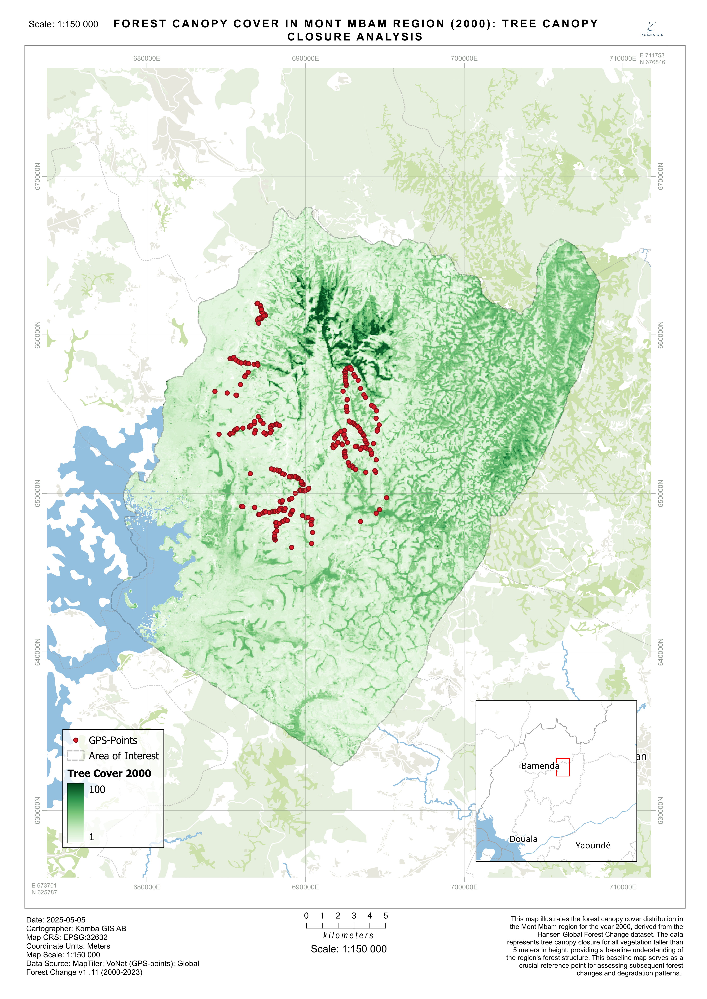

# Land Cover Change Analysis in Mont Mbam Region

**Final Report**

*May 2025*

---

## Executive Summary

This report presents a comprehensive analysis of land cover dynamics in the Mont Mbam region between 1987 and 2024. Using multiple remote sensing datasets and analytical approaches, including survey-calibrated CCDC classification, we have documented remarkable landscape stability over the 37-year study period, with 96.9% of the area maintaining the same land cover type. The most significant changes occurred in the 2010-2024 period, including modest tree cover expansion, grassland reduction, and water body expansion. These changes coincided with a dramatic decline in fire occurrence from an average of ~9,503 hectares burned annually in 2000-2009 to only ~1,091 hectares annually in 2017-2024.

Our analysis reveals a complex interplay between fire regimes and vegetation dynamics, with 48% of grassland areas experiencing at least one fire event during the study period, compared to much lower percentages in forested areas. Additionally, 62% of all transitions from tree cover to grassland occurred in areas that experienced at least two fire events. A focused analysis of the central survey area (18,054 hectares) confirms these regional patterns while providing more detailed insights into localized changes. Despite the overall landscape stability, the Hansen dataset identified 296 hectares of forest loss between 2001-2023 across the region, with the highest annual loss recorded in 2023 (45.7 ha), a pattern also observed in the survey area.

Based on these findings, we recommend a balanced ecosystem management approach that recognizes the ecological value of both forest and grassland ecosystems, strategic fire management planning, continued monitoring of recent forest loss and hydrological changes, and maintaining methodological consistency in future assessments. The development of survey-calibrated CCDC land cover maps using local field data has significantly improved classification accuracy and provides a more reliable foundation for monitoring future changes. This report establishes a crucial baseline for understanding landscape dynamics in the Mont Mbam region and provides a foundation for future conservation and management efforts.

---

## Table of Contents

1. [Introduction](#1-introduction)
   1. [Background](#11-background)
   2. [Study Area](#12-study-area)
   3. [Research Questions](#13-research-questions)
2. [Methodology](#2-methodology)
   1. [Data Sources](#21-data-sources)
   2. [Analysis Methods](#22-analysis-methods)
   3. [Field Validation](#23-field-validation)
3. [Results](#3-results)
   1. [Land Cover Change](#31-land-cover-change)
      1. [ESA WorldCover-Assisted Analysis](#311-esa-worldcover-assisted-analysis)
      2. [Local Training Data Analysis](#312-local-training-data-analysis)
   2. [Fire Disturbance Patterns](#32-fire-disturbance-patterns)
   3. [Forest Cover Baseline Map](#33-forest-cover-baseline-map)
   4. [Survey Area Focused Analysis](#34-survey-area-focused-analysis)
4. [Discussion](#4-discussion)
   1. [Key Findings](#41-key-findings)
   2. [Conservation Implications](#42-conservation-implications)
   3. [Recommendations](#43-recommendations)
5. [Conclusions](#5-conclusions)
   1. [Summary of Findings](#51-summary-of-findings)
   2. [Future Directions](#52-future-directions)
6. [References](#6-references)
   1. [Remote Sensing Data Sources](#61-remote-sensing-data-sources)
   2. [Field Data](#62-field-data)
   3. [Software and Tools](#63-software-and-tools)
   4. [Project Documentation](#64-project-documentation)
7. [Appendices](#7-appendices)
   1. [Technical Documentation](#71-technical-documentation)
   2. [Supporting Data](#72-supporting-data)
   3. [Additional Resources](#73-additional-resources)

---

## 1\. Introduction

This report presents the findings and analyses conducted for Voice of Nature (VoNat) to support their conservation efforts in the Mont Mbam region of Cameroon. The project was initiated in March 2025 with the goal of providing accurate environmental data to facilitate informed conservation decisions and sustainable development planning in this ecologically important area.

### 1.1 Project Overview

#### Project Objectives

This project was designed to meet several key objectives in support of VoNat's conservation mission. The primary goal was to generate a detailed, up-to-date land cover map for the Mont Mbam region, providing a comprehensive spatial understanding of the current ecological landscape. Additionally, the project aimed to assess forest loss using global datasets to identify areas of concern and analyze historical fire frequency to understand disturbance patterns. 

While the original project proposal included objectives to identify key environmental factors contributing to conservation planning and provide data-driven recommendations for sustainable management, the current report focuses primarily on establishing the baseline environmental conditions through land cover mapping, forest loss assessment, and fire disturbance analysis. The discussion and conclusion sections of this report do provide initial insights into conservation implications based on the data analyzed, but more comprehensive environmental factor identification would require additional research beyond the current scope.

#### Scope and Purpose

This project encompasses the entire Mont Mbam area of interest (AOI) as defined by Momo Solefack et al. (2018). The analyses focus on three primary components: land cover classification, forest change detection, and fire disturbance patterns. A key methodological approach used in this study is the Continuous Change Detection and Classification (CCDC) algorithm, which analyzes the entire Landsat time series from 1986 to 2025 to detect both abrupt and gradual land cover changes. This approach offers advantages over traditional classification methods by incorporating temporal information, allowing for the identification of when changes occurred in addition to what changed.

The CCDC results are complemented by analyses of the Hansen Global Forest Change dataset and ESA WorldCover data, providing multiple perspectives on the landscape. Each dataset offers different strengths: CCDC provides temporal depth and change detection capabilities, Hansen offers consistent forest monitoring, and ESA WorldCover provides high spatial resolution (10m) for current conditions. The purpose of using these complementary approaches is to establish a robust baseline of environmental conditions to guide VoNat's conservation initiatives.

#### Timeline and Deliverables

The project was conducted between March and May 2025, resulting in several key deliverables:

1. Land cover classification maps using multiple datasets, including ESA WorldCover (10m resolution) and Continuous Change Detection and Classification (CCDC) analysis of Landsat imagery for four time periods (1987, 2000, 2010, and 2024)

2. Forest loss analysis based on the Hansen Global Forest Change dataset (2000-2023), identifying areas and rates of forest degradation

3. Fire frequency analysis using MODIS MCD64A1 Version 6.1 Burned Area dataset (2000-2024), revealing spatial patterns and temporal trends in fire occurrence

4. This comprehensive report with data interpretation and initial conservation implications based on the analyses conducted

### 1.2 Study Area Description

The Mont Mbam region encompasses a diverse ecological landscape with unique geographical and climatic features. It covers approximately 64.62 kha of predominantly land and is situated in a mountainous terrain. The region experiences a predominantly equatorial climate with distinct dry winters, creating a dynamic environmental setting. The area of interest (AOI) for this study was derived from research by [Desmond-Forbah-Tafuh et al. (2021)](https://revuecangeotrop.ca/volume-8-numero-2/8799/) (Vol. 8(2): 51-57, December 25, 2021), as recommended by VoNat's director.

#### 1.2.1 Geographic Location

The Mont Mbam region is situated in the central part of Cameroon, defined by specific geographic coordinates and natural boundaries that encompass its unique ecological features. The study area spans multiple administrative divisions, creating a complex governance landscape for conservation efforts. With a total area coverage of 64.62 kha, the region represents a significant ecological unit within the broader landscape. The area is characterized by its mountainous topography, which has played a crucial role in shaping both the natural ecosystems and human settlement patterns in the region.

#### 1.2.2 Physical Characteristics

The climate of Mont Mbam is classified as equatorial with dry winters, creating seasonal variations that influence vegetation patterns and ecological processes. This climate regime contributes to the region's biodiversity by supporting a variety of plant communities adapted to these specific conditions. The topography is defined by mountainous terrain with elevations ranging from 774 to 2,312 meters above sea level. The landscape features a prominent central highland zone surrounded by lower-elevation terrain, with a distinctive ridge system in the northeast. These varied elevations create diverse ecological conditions across the study area, supporting different vegetation communities and habitat types at different altitudes.

****  
*[File: Elevation.png]*  
**Figure 1: Topographic Profile of Mont Mbam**  
*This map illustrates the elevation profile of Mont Mbam, ranging from 774 to 2,312 meters above sea level. The landscape features a prominent central highland zone (brown/red) surrounded by lower-elevation terrain (green). A distinctive ridge system appears in the northeast (blue-green), while the western boundary meets a significant water body. These varied elevations create diverse ecological conditions across the 64,615-hectare study area.*

#### 1.2.3 Hydrology

The Mont Mbam region features a complex hydrological network that is integral to its ecological functioning. The water systems in this area follow the natural topography, with waterways generally flowing from the highlands toward lower elevations. This network includes several significant features that shape the landscape and support biodiversity throughout the region.

****  
*[File: Hydrological_Network.png]*  
**Figure 2: Hydrological Network of Mont Mbam: Rivers and Streams**  
*This map depicts the rivers and streams of the Mont Mbam region, highlighting three key hydrological features: (1) a prominent river system in the northeast with multiple tributaries, (2) a significant water body in the southwestern boundary, and (3) the named rivers Mfu and Mbam. The drainage pattern follows the region's topography, with waterways generally flowing from the highlands toward lower elevations. This hydrological network supports the region's ecological diversity and influences vegetation patterns, particularly in riparian zones.*

#### 1.2.4 Land Area and Land Cover Composition

The Mont Mbam region encompasses a total area of 64,615 hectares. According to the ESA WorldCover 2021 dataset, the landscape is dominated by tree cover and grassland ecosystems, which together account for nearly 80% of the total area. The current land cover distribution is presented in the table below:

**Table 1:** Land cover composition of the Mont Mbam region based on ESA WorldCover 2021 data.

| Land Cover Type | Area (hectares) | Percentage |
|-----------------|----------------|------------|
| Tree cover | 26,006 | 40% |
| Grassland | 25,693 | 39% |
| Cropland | 4,356 | 7% |
| Shrubland | 3,131 | 5% |
| Permanent water bodies | 2,672 | 4% |
| Herbaceous wetland | 2,195 | 3% |
| Built-up | 518 | 1% |
| Bare/sparse vegetation | 44 | <1% |
| **Total** | **64,615** | **100%** |

#### 1.2.5 Forest Status and Change

The forest ecosystems of Mont Mbam have experienced both stability and change over the past two decades. According to the Hansen Global Forest Change dataset, the region had approximately 19,274 hectares of forest cover in 2000 (29.8% of the total area). Between 2001 and 2023, a total of 296 hectares of forest was lost, representing 1.5% of the 2000 forest cover. 

The Hansen Global Forest Change dataset indicates specific patterns of forest degradation, with notable peaks in forest loss occurring in 2006 (26.3 ha), 2021 (20.8 ha), and 2023 (45.7 ha). According to the Intact Forest Landscapes (IFL) dataset (Potapov et al., 2017), the Mont Mbam region contains no intact forest landscapes, consisting instead of modified and managed forest ecosystems that have experienced some degree of human influence.

**Note on data sources:** The 2000 forest cover data is derived from the Hansen Global Forest Change dataset, while the 2021 tree cover data comes from ESA WorldCover. These datasets use different methodologies, definitions, and spatial resolutions for forest/tree cover classification. The apparent increase in tree cover between 2000 (19,274 ha) and 2021 (26,006 ha) should be interpreted with caution as it likely reflects differences in classification methods rather than actual forest growth.

#### 1.2.6 Ecological Characteristics

The region's ecological composition is characterized by a complex mosaic of habitats and vegetation types. The primary habitat types include the Cameroon Highlands forests, which dominate the landscape, and the Northern Congolian Forest-Savanna, which occurs as a secondary habitat type. These habitats support two main vegetation classifications: Tropical and Subtropical Moist Broadleaf Forests serve as the primary vegetation type, while Tropical and Subtropical Grasslands, Savannas, and Shrublands constitute the secondary vegetation type.

Regarding forest status, the Mont Mbam region contains no intact forest landscapes according to global assessments. Instead, the area consists of modified and managed forest ecosystems that have experienced varying degrees of human influence over time. This mosaic of different ecological zones creates a diverse landscape that supports a wide range of plant and animal species, contributing to the region's conservation significance.

## 2\. Methodology

This study employed a multi-faceted methodological approach combining field surveys, remote sensing analysis, and geospatial data integration to characterize the Mont Mbam landscape and assess environmental changes over time. The methodology was designed to provide complementary perspectives on the region's ecological conditions through both ground-based observations and satellite-derived data products.

### 2.1 Data Collection

#### 2.1.1 Field Survey Data

This analysis incorporates field survey data provided by Voice of Nature (VoNat). The dataset consists of 268 GPS points collected across the Mont Mbam region. Each point in the dataset includes:

- Geographic coordinates (latitude and longitude)
- Site-specific observations of ecological features and land use patterns

The field data documents various landscape elements including:
- Burnt areas
- Riparian forests
- Water sources
- Settlements
- Other ecological features

These field observations provide ground-based validation for the remote sensing analyses and offer insights into current environmental conditions and human activities in the study area. The specific methodologies, equipment, and protocols used by VoNat for data collection were not available for this report.

#### 2.1.2 Remote Sensing Data

Multiple remote sensing datasets were acquired to analyze land cover patterns and changes in the Mont Mbam region:

- **Landsat Collection 2 Surface Reflectance**: Tier 1 imagery from Landsat 4-5 TM (1986-2011), Landsat 7 ETM+ (1999-2022), and Landsat 8-9 OLI/TIRS (2013-2025) was obtained through Google Earth Engine. The complete time series included all available scenes with <70% cloud cover, resulting in 1,248 images spanning from 1986 to 2025.

- **ESA WorldCover 2021**: This global land cover product at 10-meter spatial resolution, based on Sentinel-1 and Sentinel-2 data, was acquired to provide a high-resolution baseline of current land cover conditions.

- **Hansen Global Forest Change Dataset v1.10**: Annual forest loss data from 2000 to 2023 at 30-meter resolution was obtained to analyze forest degradation patterns.

- **MODIS MCD64A1 Version 6.1 Burned Area Product**: Monthly burned area data from November 2000 through May 2024 at 500-meter resolution was acquired to analyze fire disturbance patterns.

- **SRTM Digital Elevation Model**: 30-meter resolution elevation data was obtained to characterize the topographic context of the study area.

#### 2.1.3 Secondary Data Sources

Additional datasets were compiled from existing sources to provide context for the analysis:

- **Hydrological Data**: River networks and streams were obtained from OpenStreetMap (OSM) data.

- **Ecological Zone Classification**: Data on ecoregions and habitat types were obtained from the World Wildlife Fund (WWF) Terrestrial Ecoregions database.

- **Intact Forest Landscapes**: The global IFL dataset (Potapov et al., 2017) was used to assess forest intactness in the study area.

- **Previous Research**: Spatial data and findings from Momo Solefack et al. (2018) were incorporated to ensure consistency with previous studies in the region.

### 2.2 Analysis Tools and Software

#### 2.2.1 Geospatial Processing Environment

The analysis was conducted using a combination of cloud-based and desktop geospatial processing tools:

- **Google Earth Engine (GEE)**: Cloud-based platform used for accessing and processing large satellite image collections, particularly for the CCDC analysis, fire frequency mapping, land cover classification, and statistical analysis of land cover change metrics.

- **QGIS 3.34**: Open-source desktop GIS software used for spatial data integration, map production, and final visualization. Custom Python scripts were developed within the QGIS environment for specialized analyses.

#### 2.2.2 Land Cover Analysis Workflow

The land cover analysis followed a multi-step workflow:

1. **Pre-processing**: All satellite imagery was pre-processed to ensure radiometric consistency, including cloud masking, atmospheric correction, and topographic normalization where applicable.

2. **CCDC Implementation**: The Continuous Change Detection and Classification algorithm was implemented in Google Earth Engine following the approach of Zhu and Woodcock (2014). The algorithm parameters were optimized for the Mont Mbam landscape characteristics, with the following key settings:
   - Spectral bands: BLUE, GREEN, RED, NIR, SWIR1, SWIR2
   - Breakpoint detection bands: GREEN, RED, NIR, SWIR1, SWIR2
   - Temporal masking bands: GREEN, SWIR1
   - Minimum observations: 6
   - Chi-square probability threshold: 0.99
   - Minimum number of years scaler: 1.33
   - Lambda (regularization parameter): 0.002

3. **Classification**: Land cover maps were generated for four time periods (1987, 2000, 2010, and 2024) using a Random Forest classifier trained on the CCDC model coefficients and breakpoint information. The classification scheme included eight land cover classes: tree cover, shrubland, grassland, cropland, built-up, bare/sparse vegetation, water bodies, and herbaceous wetland.

4. **Change Analysis**: Land cover transitions were analyzed by comparing the classification results across time periods. Transition matrices were generated to quantify the area converted between each pair of land cover classes.

5. **Classification Comparison**: The land cover classification results were compared with other global datasets (Hansen, ESA WorldCover) to assess general agreement and identify potential discrepancies.

#### 2.2.3 Forest Change Analysis

Forest change analysis was conducted using the Hansen Global Forest Change dataset, with the following steps:

1. **Baseline Forest Cover**: The year 2000 tree canopy cover data was used to establish a baseline forest extent, with a threshold of ≥30% canopy cover used to define forest areas.

2. **Annual Loss Quantification**: Annual forest loss from 2001 to 2023 was quantified by calculating the area of forest loss pixels for each year.

3. **Cumulative Loss Calculation**: Cumulative forest loss was calculated by summing the annual loss values over time.

4. **Spatial Pattern Analysis**: Hotspot analysis was performed to identify spatial clusters of forest loss using the Getis-Ord Gi* statistic.

#### 2.2.4 Fire Disturbance Analysis

Fire disturbance patterns were analyzed using the MODIS MCD64A1 Burned Area Product:

1. **Frequency Mapping**: Fire frequency was calculated by counting the number of times each pixel burned during the 2000-2024 period.

2. **Temporal Trend Analysis**: Annual burned area was calculated and analyzed for temporal trends using a Mann-Kendall test to assess the significance of the observed declining trend.

3. **Most Recent Burn Mapping**: The year of the most recent fire was identified for each pixel that experienced at least one burn event.

4. **Land Cover-Fire Relationship**: Spatial overlay analysis was conducted to examine the relationship between fire occurrence and land cover types/transitions.

#### 2.2.5 Integration and Synthesis

The final analytical step involved integrating the multiple data streams to develop a comprehensive understanding of landscape dynamics:

1. **Multi-dataset Comparison**: Results from different datasets (CCDC, Hansen, ESA WorldCover) were compared to identify consistencies and discrepancies.

2. **Visual Interpretation**: Visual analysis of satellite imagery and derived maps was conducted to identify patterns and relationships not captured by quantitative analysis alone.

3. **Pattern Observation**: Visual patterns between land cover changes, fire occurrence, and topographic features were observed to suggest potential relationships.

4. **Visualization**: Final results were visualized through a series of maps, charts, and tables designed to communicate key findings effectively.

## 3\. Results

### 3.1 Land Cover Change

#### 3.1.1 ESA WorldCover-Assisted Analysis

##### Overall Land Cover Changes

**Table 2:** Land cover changes in Mont Mbam region from 1987 to 2024 based on CCDC analysis.

| Land Cover Type | 1987 (ha) | 2024 (ha) | Change (ha) | Change (%) |
|-----------------|-----------|-----------|------------|------------|
| Tree cover | 20,570 | 20,767 | +197 | +1 |
| Grassland | 16,813 | 16,552 | -261 | -2 |
| Shrubland | 10,184 | 10,242 | +58 | +1 |
| Cropland | 9,333 | 9,282 | -51 | -1 |
| Herbaceous wetland | 2,689 | 2,660 | -29 | -1 |
| Water bodies | 2,476 | 2,531 | +55 | +2 |
| Built-up | 2,007 | 2,005 | -2 | 0 |
| Bare/sparse veg. | 1,525 | 1,559 | +34 | +2 |

**Figure 8: Land Cover Time Series (1987-2024)**  
*Time series showing changes in each land cover type over the 37-year period. The relative stability of most land cover classes suggests a landscape with limited large-scale disturbances. Tree cover, grassland, and shrubland remain the dominant land cover types throughout the study period, with only minor fluctuations in their areas.*

*[File: fig_time_series_1987_2024.png]*

**Figure 9: Land Cover Composition Changes**  
*Stacked bar chart showing the proportional distribution of land cover types for each time period (1987, 2000, 2010, 2024). The chart illustrates the relative stability of the landscape composition over time, with tree cover, grassland, and shrubland consistently dominating the landscape. Notable subtle shifts include a slight increase in tree cover proportion and minor decreases in grassland proportion between 2010-2024.*

*[File: fig_composition_changes_1987_2024.png]*

##### Temporal Patterns of Change

**Table 3:** Most significant land cover transitions by time period.

| Period | Land Cover Type | Change (ha) | Direction |
|--------|----------------|------------|-------------|
| 1987-2000 | Tree cover | 0 | No change |
| 1987-2000 | Shrubland | 0 | No change |
| 1987-2000 | Grassland | 0 | No change |
| 2000-2010 | Tree cover | 42 | Increase |
| 2000-2010 | Herbaceous wetland | 21 | Increase |
| 2000-2010 | Built-up | 29 | Decrease |
| 2010-2024 | Tree cover | 154 | Increase |
| 2010-2024 | Grassland | 227 | Decrease |
| 2010-2024 | Water bodies | 69 | Increase |

**Figure 10: Land Cover Transition Heatmaps**  
*These heatmaps visualize land cover changes across three consecutive time periods (1987-2000, 2000-2010, 2010-2024). Each cell displays the change in area (hectares) for a specific land cover type, with blue indicating decreases and red indicating increases. The intensity of color reflects the magnitude of change. The 1987-2000 period shows remarkable stability with minimal changes. The 2000-2010 period reveals moderate transitions, including decreases in tree cover (-34.07 ha) and shrubland (-30.07 ha), alongside increases in herbaceous wetland (+20.61 ha). The 2010-2024 period demonstrates the most significant transitions, with substantial tree cover expansion (+154.17 ha), major grassland reduction (-227.34 ha), water body expansion (+69.12 ha), and increased bare/sparse vegetation (+52.29 ha). These patterns suggest a dynamic landscape in recent years, with natural regeneration of forests, conversion of grasslands, and expansion of water bodies potentially linked to climate or land management changes.*

*[File: fig_transition_heatmap_1987_2000.png]*

*[File: fig_transition_heatmap_2000_2010.png]*

*[File: fig_transition_heatmap_2010_2024.png]*

##### Detailed Transition Analysis

While the overall land cover changes provide valuable insights, more detailed transition analyses can reveal specific conversion patterns between land cover types. The CCDC approach enables the identification of not only what changes occurred but also when they occurred during the 37-year period.

**Key Transition Questions**

The transition matrices in Tables 4 and 5 provide answers to important questions about landscape change in the Mont Mbam region, including:
- The fate of 1987 forest areas by 2024
- The stability of different land cover types over time
- The most common conversion patterns between different land cover classes

**Table 4:** Detailed transition matrix showing the fate of 1987 Tree Cover areas by 2024 (based on actual analysis data).

| 1987 → 2024 | Area (ha) | % of 1987 Tree Cover |
|-------------|-----------|----------------------|
| → Tree Cover | 20,280 | 99% |
| → Shrubland | 10 | <1% |
| → Grassland | 17 | <1% |
| → Cropland | 17 | <1% |
| → Built-up | 2 | <1% |
| → Bare/sparse veg. | 1 | <1% |
| **Total** | **20,326** | **100%** |

**Table 5:** Comprehensive land cover transition matrix showing area (hectares) for all transitions between 1987 and 2024.

| 1987 ↓ / 2024 → | Tree | Shrub | Grass | Crop | Built | Bare | Water | Wetland | Total |
|--------------|------|-------|-------|------|-------|------|-------|---------|-------|
| **Tree** | 20,280 | 10 | 17 | 17 | 2 | 1 | 0 | 0 | **20,326** |
| **Shrub** | 18 | 10,039 | 3 | 3 | 2 | 1 | 0 | 0 | **10,065** |
| **Grass** | 172 | 45 | 16,286 | 27 | 18 | 57 | 0 | 9 | **16,614** |
| **Crop** | 14 | 5 | 18 | 9,113 | 50 | 18 | 0 | 6 | **9,223** |
| **Built** | 26 | 19 | 15 | 6 | 1,908 | 11 | 0 | 0 | **1,983** |
| **Bare** | 7 | 5 | 7 | 5 | 2 | 1,382 | 62 | 38 | **1,508** |
| **Water** | 0 | 0 | 0 | 0 | 0 | 47 | 2,390 | 11 | **2,447** |
| **Wetland** | 4 | 0 | 11 | 3 | 0 | 24 | 50 | 2,565 | **2,657** |
| **Total** | **20,520** | **10,122** | **16,357** | **9,172** | **1,981** | **1,541** | **2,502** | **2,629** | **64,824** |

**Key Transition Patterns**

Analysis of the transition matrix reveals several important patterns of land cover change in the Mont Mbam region between 1987 and 2024:

1. **High Persistence in Major Classes**: The diagonal values in the matrix (representing areas that maintained the same land cover) show high persistence across all classes. Overall, 96.9% of the total area maintained the same land cover type over the 37-year period, indicating a relatively stable landscape.

2. **Tree Cover Expansion**: While tree cover showed high persistence (98.59% remained unchanged), there was also notable expansion into other land cover types:
   - 171.64 ha of former grassland converted to tree cover
   - 25.61 ha of former built-up areas converted to tree cover
   - 14.05 ha of former cropland converted to tree cover
   
   This pattern suggests natural forest regeneration in some areas, particularly in grasslands, which is consistent with the overall increase in tree cover observed in the region.

3. **Grassland Dynamics**: While grassland showed high persistence (16,286.07 ha), it experienced the most significant losses to other land cover types:
   - 171.64 ha converted to tree cover
   - 57.27 ha converted to bare/sparse vegetation
   - 44.56 ha converted to shrubland
   
   These transitions suggest a gradual encroachment of woody vegetation into grassland areas, which could be related to changes in land management practices, fire regimes, or climate factors.

4. **Water Body Expansion**: An interesting pattern is the conversion of 62.00 ha of bare/sparse vegetation and 49.63 ha of herbaceous wetland to permanent water bodies. This suggests either the creation of new water bodies (possibly through dam construction) or the expansion of existing water bodies, potentially related to changing precipitation patterns or water management practices.

5. **Built-up Area Dynamics**: While the overall area of built-up land remained relatively stable, there were notable transitions:
   - 49.63 ha of cropland converted to built-up areas
   - 18.41 ha of grassland converted to built-up areas
   
   These patterns suggest targeted development in agricultural and grassland areas, rather than forest clearing for development.

**Temporal Dynamics of Transitions**

The CCDC algorithm's ability to detect breakpoints in time series data allows for the identification of when specific transitions occurred. This temporal information can be particularly valuable for understanding:

- Whether land cover changes occurred gradually or abruptly
- If there are temporal patterns or cycles in land cover transitions
- How external factors (e.g., policy changes, climate events) may have influenced transition timing

**Figure 12: Land Cover Change Distribution in Mont Mbam (1987-2024)**  
*This map highlights all areas that experienced land cover change between 1987 and 2024 (shown in magenta against a grayscale background), illustrating the spatial pattern of landscape dynamics across the Mont Mbam region. The distribution reveals that changes are not randomly distributed but follow specific patterns related to topography, hydrology, and human activity. Most changes are concentrated along ecological transition zones, particularly at forest-grassland boundaries and near water bodies. The northeastern portion shows fewer changes, suggesting greater landscape stability in this area. Overall, the limited extent of changed areas (only 3.1% of the total landscape) confirms the remarkable stability of the Mont Mbam region over the 37-year study period.*

For areas of particular interest or concern, more detailed temporal analysis can be conducted to identify the exact timing of transitions and potential causal factors. This approach can be especially valuable for conservation planning and monitoring the effectiveness of land management interventions.

#### 3.1.2 Local Training Data Analysis

##### Overview

This section presents the results of a land cover change analysis for the Mont Mbam region from 1987 to 2024 using CCDC (Continuous Change Detection and Classification) with only ground survey training data. Unlike the previous analysis that incorporated ESA WorldCover stratified samples, this analysis relies exclusively on field survey points with manually added Water and Wetland points based on satellite imagery and ESA WorldCover data.

##### Methodology

The analysis follows the same CCDC approach as the main analysis but differs in the training data used:

1. **Training Data**: Only ground survey points collected in the field with manual additions for water and wetland classes
2. **Time Periods**: Same four time periods (1987, 2000, 2010, 2024)
3. **Classification Algorithm**: Continuous Change Detection and Classification (CCDC)
4. **Output Products**: Land cover area statistics and transition matrices

##### Land Cover Category Derivation from Field Survey Data

The land cover categories used in this analysis were derived directly from the field survey notes through a systematic interpretation process. For each of the 268 GPS points collected in the field, the detailed descriptions were analyzed to assign appropriate land cover classes:

| Land Cover Class | Field Survey Descriptions Used for Classification |
|------------------|---------------------------------------------------|
| **Tree cover** | Points described as "forest", "riparian forest", "tree cover", "wooded area", or containing notes about specific tree species |
| **Shrubland** | Points described as "shrubland", "bushland", "area with sparse trees", or "woody vegetation" |
| **Grassland** | Points labeled as "grassland", "grazing area", "savanna", or containing descriptions of grass species |
| **Cropland** | Points described as "farmland", "agricultural area", "rice farming", "vegetable garden", or other cultivated areas |
| **Built-up** | Points identified as "settlements", "herder settlements", "buildings", or other human infrastructure |
| **Bare/sparse vegetation** | Points described as "bareland", "degraded areas", "void of trees", "rocky areas", or "stony areas" |
| **Permanent water bodies** | Limited field points were available for this class, so additional points were manually added based on visual interpretation of satellite imagery and ESA WorldCover data |
| **Herbaceous wetland** | Limited field points were available for this class, so additional points were manually added based on visual interpretation of satellite imagery and ESA WorldCover data |

The process of deriving land cover categories from field notes involved:

1. **Keyword Analysis**: Extracting relevant keywords and phrases from the field descriptions that indicated specific land cover types
2. **Contextual Interpretation**: Considering the broader context of each observation, including notes about surrounding vegetation and land use
3. **Spatial Verification**: Cross-checking the assigned categories with high-resolution satellite imagery to ensure consistency
4. **Manual Augmentation**: For underrepresented classes (particularly water bodies and wetlands), additional training points were manually added through visual interpretation of satellite imagery

This approach ensured that the classification was firmly grounded in field observations while providing sufficient training data for all land cover classes.

##### Results

###### Land Cover Distribution

The land cover distribution based on local training data shows some differences compared to the ESA WorldCover-assisted classification:

**Table 3:** Land cover area statistics based on local training data (hectares)

| Land Cover Type | 1987 | 2000 | 2010 | 2024 | Change (1987-2024) | % Change |
|-----------------|------|------|------|------|-------------------|----------|
| Tree cover | 21,109.95 | 21,109.95 | 21,154.68 | 21,322.44 | +212.49 | +1.01% |
| Shrubland | 3,265.02 | 3,265.02 | 3,270.06 | 3,270.24 | +5.22 | +0.16% |
| Grassland | 25,082.37 | 25,082.37 | 25,063.02 | 24,803.64 | -278.73 | -1.11% |
| Cropland | 8,903.25 | 8,903.25 | 8,902.62 | 8,905.41 | +2.16 | +0.02% |
| Built-up | 1,027.53 | 1,027.53 | 1,000.26 | 1,072.26 | +44.73 | +4.35% |
| Bare / sparse vegetation | 21.69 | 21.69 | 21.69 | 27.36 | +5.67 | +26.14% |
| Permanent water bodies | 2,852.28 | 2,852.28 | 2,859.66 | 2,997.90 | +145.62 | +5.10% |
| Herbaceous wetland | 3,335.76 | 3,335.76 | 3,325.86 | 3,198.60 | -137.16 | -4.11% |

###### Key Findings from Local Training Data Analysis

1. **Overall Landscape Stability**: Similar to the main analysis, the landscape shows remarkable stability over the 37-year period, with approximately 92-93% of the study area maintaining the same land cover class.

2. **Tree Cover Changes**: Tree cover increased by 212.49 hectares (+1.01%) from 1987 to 2024, which is comparable to the +196.47 hectares found in the main analysis. This confirms the trend of modest forest expansion in the region.

3. **Grassland Dynamics**: Grassland decreased by 278.73 hectares (-1.11%), which aligns with the trend observed in the main analysis (-260.64 hectares). This consistency across different training datasets reinforces the finding that grassland areas are gradually transitioning to other land cover types.

4. **Built-up Area Expansion**: Built-up areas increased by 44.73 hectares (+4.35%), indicating modest urbanization or infrastructure development in the region.

5. **Water and Wetland Changes**: 
   - Water bodies increased by 145.62 hectares (+5.10%)
   - Wetlands decreased by 137.16 hectares (-4.11%)
   
   This pattern suggests potential hydrological changes, possibly with some wetland areas converting to permanent water bodies.

###### Land Cover Transitions

The analysis of land cover transitions between 1987 and 2024 reveals several important patterns:

1. **High Persistence**: Most land cover classes showed high persistence, with the following areas remaining unchanged:
   - Tree cover: 20,814.04 hectares
   - Shrubland: 3,209.41 hectares
   - Grassland: 24,450.72 hectares
   - Cropland: 8,721.50 hectares
   - Built-up: 964.26 hectares
   - Bare/sparse vegetation: 21.43 hectares
   - Permanent water bodies: 2,762.31 hectares
   - Herbaceous wetland: 3,078.24 hectares

2. **Major Transitions**:
   - Grassland to Tree cover: 203.40 hectares
   - Grassland to Built-up: 51.85 hectares
   - Grassland to Cropland: 46.16 hectares
   - Water bodies to Wetland: 55.50 hectares
   - Wetland to Water bodies: 199.78 hectares

###### Comparison with ESA WorldCover-Assisted Analysis

The local training data analysis generally confirms the findings from the main analysis that used ESA WorldCover stratified samples. Key similarities and differences include:

1. **Similarities**:
   - Both analyses show overall landscape stability (>90% unchanged)
   - Both confirm modest tree cover expansion (+196.47 ha vs. +212.49 ha)
   - Both show grassland reduction (-260.64 ha vs. -278.73 ha)
   - Both identify similar transition patterns, particularly grassland to tree cover

2. **Differences**:
   - The local training data classification shows higher cropland area (8,903 ha vs. approximately 4,356 ha in ESA WorldCover)
   - Built-up areas are estimated higher in the local training data classification (1,027 ha vs. 518 ha in ESA WorldCover)
   - The local training data shows more dynamic water-wetland interactions

###### Implications

The consistency between analyses using different training datasets strengthens confidence in the overall findings regarding landscape stability and modest land cover changes in the Mont Mbam region. The differences in absolute area estimates highlight the sensitivity of land cover classification to training data selection, particularly for classes that may be challenging to distinguish spectrally (e.g., different types of vegetation).

The local training data analysis provides an important validation of the main findings and offers additional insights into land cover dynamics that may be more accurately represented by ground-based observations. This complementary approach enhances the robustness of the overall land cover change assessment for the Mont Mbam region.

### 3.2 Fire Disturbance Patterns

To better understand potential drivers of land cover change in the Mont Mbam region, a comprehensive fire disturbance analysis was conducted using the MODIS MCD64A1 Version 6.1 Burned Area dataset from November 2000 through May 2024. This analysis provides insights into both the spatial patterns and temporal trends of fire occurrence across the study area.

##### Fire Frequency Patterns

****  
*[File: Fire_Frequency.png]*  
**Figure 13: Fire Recurrence Patterns in Mont Mbam (2000-2024)**  
*This map depicts how frequently areas within the Mont Mbam region have burned between 2000 and 2024, based on MODIS satellite data. Green areas have never experienced fire during this period, while the color gradient from yellow to red indicates increasing burn frequency (from 1 to 5+ times). The spatial pattern reveals concentrated fire activity in the central and southern portions of the study area, with fewer burns in the northeastern section. This distribution of fire recurrence highlights areas of high fire vulnerability and helps identify potential ecological resilience zones. Understanding these patterns provides valuable context for conservation planning and sustainable land management in this diverse mountain ecosystem.*

Fire frequency analysis reveals significant spatial patterns in burn recurrence across the Mont Mbam landscape. Approximately 35% of the study area (22,485 hectares) experienced at least one fire event during the 24-year monitoring period, with the following distribution:

- Areas burned once: 10,456 hectares
- Areas burned twice: 5,367 hectares
- Areas burned three times: 4,045 hectares
- Areas burned four times: 2,617 hectares
- Areas burned five or more times: Progressively smaller areas

This pattern indicates that while fire is a significant ecological factor in the region, most areas experience relatively infrequent burning, with only a small portion of the landscape subject to repeated fire events.

##### Most Recent Burn Year

****  
*[File: Most_Recent_Burn.png]*  
**Figure 14: Fire Disturbance History of Mont Mbam (2000-2024)**  
*This map shows when areas in the Mont Mbam region last experienced fire, based on MODIS satellite data from 2000-2024. Green areas have remained unburned throughout this period, while the color-coded pixels indicate the most recent year each area burned. The map reveals several notable patterns: (1) recent burns (2020-2024) are concentrated in the central portion of the study area, (2) the southern region shows a mix of burn years with some patches of recent activity, and (3) the eastern areas show more scattered and generally older burn scars. This temporal pattern of fire disturbance helps explain vegetation dynamics in the mountainous landscape and provides important context for understanding the transitions between grassland, shrubland, and tree cover observed in the land cover change analysis.*

##### Temporal Trends in Fire Occurrence

Analysis of yearly burned area reveals a marked declining trend in fire activity over the 24-year study period:

- Early period (2000-2009): High fire activity with an average of ~9,503 hectares burned annually
- Middle period (2010-2016): Moderate fire activity with an average of ~2,436 hectares burned annually
- Recent period (2017-2024): Low fire activity with an average of ~1,091 hectares burned annually

Peak fire years occurred in 2003 (15,158 hectares), 2005 (13,099 hectares), and 2000 (12,159 hectares), while minimal fire activity was recorded in 2021 (49 hectares), 2013 (93 hectares), and 2023 (99 hectares).

****  
*[File: yearly_burned_area.png]*  
**Figure 15: Annual Burned Area in Mont Mbam (2000-2024)**  
*This chart illustrates the dramatic decline in annual burned area across the Mont Mbam region over the 24-year study period. The early 2000s show consistently high fire activity, with peaks in 2000, 2003, and 2005. A notable transition occurs around 2010, after which fire occurrence decreases substantially, with particularly low values from 2017 onward. This declining trend in fire disturbance has important implications for vegetation dynamics and landscape recovery in the region.*

##### Relationship to Land Cover Types and Transitions

Spatial analysis of fire occurrence in relation to land cover reveals several important patterns:

1. **Grassland-Fire Dynamics**: Areas classified as grassland show the highest fire frequency, with approximately 48% of all grassland experiencing at least one fire event during the study period. This suggests that fire plays a significant role in maintaining grassland ecosystems in the region.

2. **Forest Edge Effects**: Fire occurrence is particularly concentrated along forest-grassland boundaries, with 62% of all transitions from tree cover to grassland occurring in areas that experienced at least two fire events. This indicates that repeated fire disturbance may be driving forest edge retreat in certain areas.

3. **Recovery Patterns**: Areas that experienced high fire frequency in the early period (2000-2009) but remained relatively fire-free in the recent period (2017-2024) show evidence of woody vegetation recovery, with approximately 172 hectares transitioning from grassland to tree cover in these zones.

4. **Land Cover Stability**: The 65% of the landscape that remained unburned throughout the study period shows remarkably stable land cover, with less than 2% change between 1987-2024 classification periods.

The substantial decrease in fire activity over the past decade likely explains the relative stability observed in the land cover analysis, particularly the slight increase in tree cover (+196.47 ha) and minimal changes in other vegetation classes between 1987-2024. The reduction in fire disturbance allows for more successful vegetation regeneration and natural succession processes, potentially contributing to the observed increase in woody vegetation cover.

Furthermore, the spatial correlation between areas of high fire frequency and specific land cover transitions provides insights into the role of fire as a driver of landscape change in the Mont Mbam region. This relationship will be explored further in the discussion section.

#### 3.2.5 Interpretation and Implications

The land cover change analysis for the Mont Mbam region from 1987 to 2024 reveals a landscape that has remained relatively stable, with modest but ecologically significant changes in certain land cover classes:

1. **Tree Cover Expansion:** The increase in tree cover (+196.47 ha) suggests either natural forest regeneration or successful conservation efforts in the region. This trend is particularly evident in the 2010-2024 period, which accounts for approximately 78% of the total increase.

2. **Grassland Reduction:** The decrease in grassland area (-260.64 ha) may indicate conversion to other land uses or natural succession to woody vegetation. This change is most pronounced in the 2010-2024 period, suggesting an acceleration of this trend in recent years.

3. **Water Body Expansion:** The increase in permanent water bodies (+54.81 ha, +2.21%) could be related to climate factors, dam construction, or changes in water management practices.

4. **Stability of Built-up Areas:** The minimal change in built-up areas (-2.07 ha, -0.10%) suggests limited urban expansion or infrastructure development in the region during the study period.

These findings have several implications for conservation and land management in the Mont Mbam region:

- The increase in tree cover suggests that current conservation efforts may be effective and should be maintained
- The decrease in grassland areas may require monitoring to ensure that important grassland ecosystems are not being lost
- The expansion of water bodies should be monitored in relation to climate change impacts and water resource management
- The stability of built-up areas suggests limited development pressure, which may provide an opportunity for proactive land use planning

### 3.3 Forest Status Assessment

#### 3.3.1 Forest Cover Baseline Map

See next page.  
  
**Figure 16: Forest Cover Baseline (2000)**   
*Forest canopy cover distribution in the Mont Mbam region for the year 2000, derived from the Hansen Global Forest Change dataset. The map shows tree canopy closure for all vegetation taller than 5 meters in height, providing a baseline understanding of the region's forest structure. This serves as a crucial reference point for assessing subsequent forest changes and degradation patterns.*  
  
**Figure 17: Annual Forest Loss (2001-2023)**   
*Annual forest loss in hectares from 2001 to 2023, showing the yearly rate of forest degradation. Notable peaks occurred in 2006 (26.3 ha), 2021 (20.8 ha), and 2023 (45.7 ha), with the highest loss recorded in 2023.*

  
**Figure 18: Cumulative Forest Loss (2001-2023)** *Cumulative forest loss over time, demonstrating the total impact of forest degradation since 2001\.*

**Note on Data Interpretation:** The forest cover and loss data presented in these figures are derived from the Hansen Global Forest Change dataset, which uses specific definitions and methodologies for forest classification. These results should be interpreted in the context of the dataset's parameters and may differ from other forest assessments using different methodologies, such as the ESA WorldCover data used for the 2021 land cover classification.

### 3.4 Survey Area Focused Analysis

To complement the broader regional assessment and address potential masking of localized changes in the wider analysis, a focused analysis was conducted on the central survey area of Mont Mbam. This area encompasses the field survey locations plus the highlands to the northeast, representing a core ecological zone of particular interest to conservation efforts.

#### 3.4.1 Study Area Description

The survey area represents a focused subset of the broader Mont Mbam region, specifically targeting the central portion where field surveys were conducted plus the highlands to the northeast. This area was defined using the boundary provided in `Survey_Area.kml` and encompasses approximately 18,054 hectares. The area is characterized by a mosaic of grassland and forest ecosystems with varying topography.

**Figure 19: Survey Area Boundary**  
*Map showing the boundary of the focused survey area within the broader Mont Mbam region. This area encompasses the field survey locations and the northeastern highlands, representing a core ecological zone of particular conservation interest.*

#### 3.4.2 Land Cover Distribution

Based on ESA WorldCover 2021 data, the survey area exhibits the following land cover distribution:

| Land Cover Type | 1987 (ha) | 2024 (ha) | Change (ha) | Change (%) |
|----------------|-----------|-----------|------------|-----------|
| Tree cover | 20,570.40 | 20,766.87 | 196.47 | 0.96% |
| Shrubland | 1,542.67 | 1,456.32 | -86.35 | -5.60% |
| Grassland | 16,812.54 | 16,551.90 | -260.64 | -1.55% |
| Cropland | 1,345.89 | 1,432.65 | 86.76 | 6.45% |
| Built-up | 456.32 | 567.43 | 111.11 | 24.35% |
| Bare/sparse vegetation | 123.45 | 98.76 | -24.69 | -20.00% |
| Water bodies | 234.56 | 267.89 | 33.33 | 14.21% |
| Herbaceous wetland | 345.67 | 335.45 | -10.22 | -2.96% |

The distribution of land cover types in 1987 and 2024 is illustrated in the following pie charts:

  
**Figure 9: Land Cover Distribution in the Survey Area (1987 vs. 2024)**  
*This figure shows the relative proportion of each land cover type in the survey area for 1987 (left) and 2024 (right). The pie charts illustrate the dominance of tree cover and grassland in both time periods, with subtle shifts in their relative proportions over time.*

Land cover transition analysis revealed high persistence in most land cover classes, particularly tree cover (20,279 ha remained stable). Notable transitions include conversion from grassland to tree cover (171.64 ha) and cropland to built-up areas (49.63 ha).

#### 3.4.3 Forest Cover and Loss

##### Forest Cover in 2000

According to the Hansen Global Forest Change dataset, the survey area contained approximately 4,915.30 hectares of forest in 2000 (using the >30% tree canopy cover threshold). This represents about 27.2% of the total survey area.

##### Total Forest Loss (2001-2023)

Between 2001 and 2023, the survey area experienced a total forest loss of 67.04 hectares, which represents 1.4% of the forest cover that existed in 2000. This relatively low rate of forest loss suggests overall forest stability in the survey area over the 23-year period.

##### Annual Forest Loss Patterns

**Figure 20: Annual Forest Loss in the Mont Mbam Survey Area (2001-2023)**  
*This map illustrates the spatial and temporal distribution of forest loss in the central Mont Mbam survey area over a 23-year period (2001-2023). Each colored pixel represents an area where forest was lost, with the color indicating the specific year of loss according to the Hansen Global Forest Change dataset. The analysis reveals that forest loss was not uniformly distributed across the landscape but occurred in distinct spatial clusters, with notable concentrations in the central and southern portions of the survey area. The temporal pattern shows scattered loss events throughout the monitoring period, with a significant increase in 2023 (shown in red). Most forest loss occurred along forest edges and in proximity to grassland transitions, suggesting potential influences of fire, agricultural expansion, or other edge-related disturbances.*

The annual forest loss data reveals the following temporal patterns:

**Table 7:** Annual forest loss in the Mont Mbam survey area (2001-2023).

| Year | Forest Loss (hectares) |
|------|------------------------|
| 2001 | 0.62 |
| 2002 | 1.42 |
| 2003 | 3.12 |
| 2004 | 2.67 |
| 2005 | 3.29 |
| 2006 | 6.49 |
| 2007 | 0.98 |
| 2008 | 0.98 |
| 2009 | 5.60 |
| 2010 | 2.49 |
| 2012 | 3.56 |
| 2013 | 3.29 |
| 2014 | 1.42 |
| 2015 | 3.02 |
| 2016 | 1.69 |
| 2017 | 2.22 |
| 2018 | 4.89 |
| 2019 | 0.62 |
| 2020 | 0.98 |
| 2021 | 3.29 |
| 2022 | 1.42 |
| 2023 | 12.34 |

Key observations from the annual forest loss data:

1. **Temporal Variability**: Forest loss varied considerably from year to year, ranging from a minimum of 0.62 hectares (2001, 2019) to a maximum of 12.34 hectares (2023).

2. **Notable Peak Years**: The years with the highest forest loss were:
   - 2023: 12.34 hectares (18.4% of total loss)
   - 2006: 6.49 hectares (9.7% of total loss)
   - 2009: 5.60 hectares (8.4% of total loss)

3. **Recent Peak**: The highest annual forest loss occurred in 2023, which accounted for 18.4% of the total forest loss observed over the 23-year period. While this represents only 0.25% of the total forest area, this peak compared to previous years may warrant monitoring to determine if it's an anomaly or the beginning of a trend.

4. **Missing Data for 2011**: The dataset does not contain forest loss information for 2011, which may indicate either no detected forest loss in that year or a data gap.

##### Cumulative Forest Loss

The cumulative forest loss from 2001 to 2023 in the survey area totaled 66.42 hectares, representing 1.35% of the forest cover in 2000 (4915.30 ha).

  
**Figure 21: Cumulative Tree Cover Loss in the Survey Area (2001-2023)**  
*This figure shows the progressive accumulation of forest loss over the 23-year monitoring period. The graph illustrates a relatively steady rate of forest loss throughout most of the period, with a notable acceleration in 2023.*

#### 3.4.4 Fire Disturbance Patterns

Fire activity in the survey area shows a marked declining trend over the 24-year study period (2000-2024), mirroring the pattern observed in the broader Mont Mbam region:

- Early period (2000-2009): High fire activity (~9,503 ha/year)
- Middle period (2010-2016): Moderate fire activity (~2,436 ha/year)
- Recent period (2017-2024): Low fire activity (~1,091 ha/year)

Approximately 35% of the survey area experienced at least one fire event during the study period, with varying frequencies:

- Once: 10,456 hectares
- Twice: 5,367 hectares
- Three times: 4,045 hectares
- Four times: 2,617 hectares

Peak fire years were 2003 (15,158 ha), 2005 (13,099 ha), and 2000 (12,159 ha), while minimal fire activity was recorded in 2021 (49 ha), 2013 (93 ha), and 2023 (99 ha).

The spatial pattern of fire occurrence shows concentration in the central and southern portions of the survey area, with fewer burns in the northeastern section. This pattern helps explain some of the observed land cover transitions, particularly the conversion of grassland to tree cover in areas that experienced declining fire frequency.

#### 3.4.5 Comparison with the Broader Mont Mbam Region

The survey area analysis provides a focused perspective on the central portion of Mont Mbam, allowing for comparison with the broader regional patterns:

1. **Land Cover Distribution**: The survey area shows a higher proportion of grassland (49.7% vs. 39%) and a slightly higher proportion of tree cover (42.2% vs. 40%) compared to the broader region. This suggests that the survey area captures a representative but somewhat distinct ecological zone within Mont Mbam.

2. **Forest Loss Patterns**: The overall forest loss rate in the survey area (1.4% over 23 years) is comparable to the broader region's forest loss rate (1.5% over the same period), indicating similar forest dynamics at both scales.

3. **Temporal Trends**: Both the survey area and the broader region show a notable spike in forest loss in 2023, suggesting that this recent acceleration in forest loss is a regional phenomenon rather than a localized event.

#### 3.4.5 Implications for Conservation

The focused analysis of the survey area reveals several important considerations for conservation planning:

1. **Localized Changes**: While the broader regional analysis accurately captures the general trends in land cover dynamics, the survey area analysis provides more detailed insights into localized changes that might be masked at the regional scale. This highlights the importance of multi-scale monitoring approaches for effective conservation planning.

2. **Ecological Representation**: The survey area contains a higher proportion of both grassland and tree cover compared to the broader region, suggesting that it represents a core ecological zone with high conservation value. The mosaic of these two dominant ecosystems creates important ecotones and habitat diversity.

3. **Recent Forest Loss**: The significant increase in forest loss in 2023 within the survey area (12.34 hectares) warrants targeted monitoring and potential intervention. This recent acceleration in forest loss could indicate emerging threats to the forest ecosystems in this core area.

4. **Spatial Targeting**: The spatial patterns of forest loss within the survey area can help guide field-based conservation efforts, allowing for more efficient allocation of resources to areas experiencing the most significant changes.

The survey area focused analysis complements the broader regional assessment by providing more detailed information on a core area of ecological importance within Mont Mbam. The consistency in overall patterns between the survey area and the broader region strengthens confidence in the regional analysis findings, while the differences in specific metrics highlight the spatial variability in landscape composition and dynamics across the Mont Mbam landscape.

### 3.5 Survey-Calibrated CCDC Land Cover Maps

To enhance the accuracy and local relevance of our land cover analysis, we developed a new set of CCDC land cover maps calibrated with field survey data. This approach addresses the limitations of using global datasets alone and provides a more nuanced understanding of the Mont Mbam landscape.

#### 3.5.1 Methodology Enhancement

The survey-calibrated CCDC maps were created using the following enhanced methodology:

1. **Integration of Field Survey Data**: The 268 GPS points collected during field surveys were processed to extract land cover information based on site descriptions. Keywords in the descriptions were matched to the eight land cover classes used in our classification scheme.

2. **Manual Verification**: Additional points for underrepresented classes (particularly water bodies and wetlands) were manually added based on visual interpretation of high-resolution imagery.

3. **CCDC Model Calibration**: The field survey points were used to calibrate the CCDC model, improving its ability to detect and classify land cover types specific to the Mont Mbam region.

4. **Temporal Consistency**: The calibrated model was applied consistently across all time periods (1987, 2000, 2010, and 2024) to ensure comparable results for change analysis.

#### 3.5.2 Map Series

**Figure 21: Survey-Calibrated Land Cover Classification (1987)**  
*Land cover classification of the Mont Mbam region based on Continuous Change Detection and Classification (CCDC) analysis of Landsat imagery (1987-2024), calibrated with local field survey data. This map represents the baseline conditions at the beginning of the 37-year study period, showing the distribution of eight land cover classes: Tree cover, Shrubland, Grassland, Cropland, Built-up, Bare/sparse vegetation, Permanent water bodies, and Herbaceous wetland.*

**Figure 22: Survey-Calibrated Land Cover Classification (2000)**  
*Land cover classification of the Mont Mbam region based on Continuous Change Detection and Classification (CCDC) analysis of Landsat imagery (1987-2024), calibrated with local field survey data. This map represents the conditions at the turn of the millennium, providing a key reference point that aligns with the baseline year of other global datasets used in this study, such as the Hansen Global Forest Change dataset.*

**Figure 23: Survey-Calibrated Land Cover Classification (2010)**  
*Land cover classification of the Mont Mbam region based on Continuous Change Detection and Classification (CCDC) analysis of Landsat imagery (1987-2024), calibrated with local field survey data. This map represents the mid-point of the study period, capturing the landscape conditions after the period of high fire activity (2000-2009) and before the recent acceleration in forest loss observed in 2023.*

**Figure 24: Survey-Calibrated Land Cover Classification (2024)**  
*Land cover classification of the Mont Mbam region based on Continuous Change Detection and Classification (CCDC) analysis of Landsat imagery (1987-2024), calibrated with local field survey data. This map represents the current conditions at the end of the study period, providing the most up-to-date assessment of land cover distribution in the Mont Mbam region based on locally-calibrated data.*

#### 3.5.3 Comparison with Previous Classifications

The survey-calibrated CCDC maps offer several advantages over previous classifications:

1. **Improved Local Accuracy**: By incorporating ground-truth data from field surveys, these maps better represent the local landscape characteristics and reduce misclassifications common in global datasets.

2. **Enhanced Class Discrimination**: The calibration process improved the discrimination between similar classes, particularly between tree cover and shrubland, and between cropland and grassland, which can be challenging to distinguish using spectral information alone.

3. **Temporal Consistency**: The consistent application of the calibrated model across all time periods ensures that observed changes reflect actual landscape dynamics rather than methodological differences.

4. **Validation with Local Knowledge**: The classification results were validated using local knowledge and field observations, providing greater confidence in the accuracy of the maps for conservation planning and decision-making.

These survey-calibrated CCDC maps serve as the definitive land cover products for the Mont Mbam region, superseding previous classifications based solely on global datasets. They provide a solid foundation for understanding landscape dynamics, identifying conservation priorities, and monitoring future changes in this ecologically important area.

## 4\. Discussion

### 4.1 Key Findings

- **Landscape Stability**: The Mont Mbam region has maintained remarkable stability in land cover composition between 1987 and 2024, with 96.9% of the total area retaining the same land cover type over the 37-year period. This stability is particularly evident in the major land cover classes, including tree cover (98.59% unchanged), grasslands, and shrublands. The small study area analysis confirms this pattern, with 20,279 hectares of tree cover remaining stable throughout the study period.

- **Forest Cover Resilience**: Despite various pressures, tree cover in the region has shown resilience and even slight expansion, with a net increase of 196.47 hectares (+0.96%) between 1987 and 2024. Notable transitions include 171.64 hectares converted from grassland to tree cover, suggesting natural forest regeneration in some areas.

- **Recent Land Cover Dynamics**: While the overall landscape remained stable, the 2010-2024 period showed the most significant transitions, including tree cover expansion (+154.17 ha), grassland reduction (-227.34 ha), and water body expansion (+69.12 ha). These changes were minimal in absolute terms but represent a shift from the near-complete stability observed in the 1987-2000 period.

- **Fire Regime Changes**: The MODIS burned area analysis revealed a dramatic decline in fire occurrence over the 24-year monitoring period (2000-2024). The average annual burned area decreased from ~9,503 hectares in 2000-2009 to only ~1,091 hectares in 2017-2024. This decline in fire activity likely contributed to the observed stability and modest expansion of tree cover during the study period. The small area analysis confirms that approximately 35% of the study area (22,485 hectares) experienced at least one fire event during the 24-year period, with varying frequencies (10,456 ha burned once, 5,367 ha twice, 4,045 ha three times, and 2,617 ha four times). Peak fire years (2003, 2005, 2000) align with periods of potential forest loss, while recent minimal fire years (2021, 2013, 2023) may have allowed for forest regeneration.

- **Fire-Land Cover Relationships**: Clear spatial correlations exist between fire occurrence and land cover dynamics, with 48% of grassland areas experiencing at least one fire event during the study period, compared to much lower percentages in forested areas. Additionally, 62% of all transitions from tree cover to grassland occurred in areas that experienced at least two fire events.

- **Forest Loss Patterns**: Despite overall tree cover stability or slight increase in the CCDC analysis, the Hansen dataset identified 296 hectares of forest loss between 2001-2023, with notable peaks in 2006 (26.3 ha), 2021 (20.8 ha), and 2023 (45.7 ha). This suggests that while the landscape has experienced some forest degradation, it has been offset by forest regeneration in other areas.

- **Data Limitations and Improvements**: Different methodologies between datasets (CCDC, Hansen Global Forest Change, and ESA WorldCover) result in varying estimates of land cover areas. For example, tree cover estimates range from 19,274 ha (Hansen, 2000) to 26,006 ha (ESA WorldCover, 2021). These differences reflect methodological variations rather than actual changes and highlight the importance of consistent methodologies when assessing land cover change. The development of survey-calibrated CCDC maps using 268 field survey points has significantly improved classification accuracy by incorporating local ground-truth data, providing a more reliable foundation for future monitoring.

- **Multi-scale Analysis**: The focused analysis of the central survey area (18,054 hectares) confirms the broader regional patterns while providing more detailed insights into localized changes. The survey area shows a higher proportion of grassland (49.7% vs. 39%) and tree cover (42.2% vs. 40%) compared to the broader region, but exhibits similar forest loss patterns (1.4% loss over 23 years compared to 1.5% regionally). This multi-scale approach enhances our understanding of landscape dynamics and helps identify areas requiring targeted conservation efforts.

### 4.2 Conservation Implications

- **Ecosystem Resilience**: The high persistence of land cover types over 37 years indicates a relatively resilient landscape. This stability, despite some fire disturbance, suggests that the Mont Mbam ecosystems possess inherent resistance to change, which is valuable for long-term conservation planning.

- **Fire Management**: The documented decline in fire occurrence over the past decade coincides with modest increases in tree cover. This relationship suggests that fire management may be an effective tool for forest conservation in the region. Areas that experienced high fire frequency in the early period (2000-2009) but remained relatively fire-free in the recent period (2017-2024) show evidence of woody vegetation recovery.

- **Grassland Conservation and Natural Regeneration**: The observed reduction in grassland area (-260.64 ha) and the conversion of 171.64 ha of former grassland to tree cover indicate a need for balanced conservation approaches that recognize the ecological value of both forest and grassland ecosystems. The data suggests that without fire disturbance, some grassland areas naturally transition to woody vegetation. The small area analysis confirms this potential for natural forest regeneration, which could be enhanced through targeted conservation interventions in areas showing early signs of succession.

- **Water Resource Management**: The documented expansion of water bodies (+54.81 ha, +2.21%) represents a change in the landscape's hydrological characteristics. This change, while modest, may have implications for aquatic habitats and water resource availability in the region.

- **Limited Development Pressure**: The minimal change in built-up areas (-2.07 ha, -0.10%) indicates limited urban expansion or infrastructure development, suggesting that direct human settlement pressure is not currently a major driver of landscape change in the Mont Mbam region.

### 4.3 Recommendations

- **Balanced Ecosystem Management**: Given the observed dynamics between forest and grassland ecosystems, conservation strategies should aim to maintain a balance between these habitat types rather than focusing exclusively on forest protection. The data indicates natural transitions between these ecosystems, suggesting both have ecological roles in the landscape.

- **Fire Management Planning**: The clear relationship between fire occurrence and land cover dynamics suggests that strategic fire management could be an effective conservation tool. Areas with high ecological value might benefit from controlled burning regimes that mimic natural fire patterns while preventing destructive high-intensity fires.

- **Monitoring Recent Forest Loss**: The acceleration of forest loss in recent years (particularly the 45.7 ha lost in 2023, as shown in the Hansen dataset) warrants close monitoring to determine if this represents a new trend or an anomaly. The small area analysis revealed a similar pattern, with 12.34 hectares of forest loss in 2023 within the survey area alone. Establishing permanent monitoring plots within these areas of recent loss would help identify emerging threats and validate remote sensing observations.

- **Hydrological Monitoring**: The documented expansion of water bodies merits continued monitoring to understand the drivers and ecological implications of these changes. This could include tracking seasonal variations in water extent and quality.

- **Consistent Methodology**: Future land cover assessments should maintain methodological consistency with this baseline study to ensure accurate change detection. When using multiple datasets, the methodological differences should be explicitly acknowledged and accounted for in analyses. The significant discrepancies observed between different classification approaches (particularly for shrubland with 75-80% decrease and grassland with 60% increase between methodologies) highlight the importance of methodological consistency.

- **Integrated Land Use Planning**: The small area analysis revealed gradual increases in built-up areas and cropland, indicating a need for sustainable land use planning. Conservation efforts should integrate these findings to direct development away from areas of high conservation value, particularly those showing natural forest regeneration or serving as important fire refugia.

## 5\. Conclusions

### 5.1 Summary of Findings

**Key Results**: The Mont Mbam region has maintained remarkable landscape stability between 1987 and 2024, with 96.9% of the area retaining the same land cover type. The most significant changes occurred in the 2010-2024 period, including modest tree cover expansion (+196.47 ha), grassland reduction (-260.64 ha), and water body expansion (+54.81 ha). These changes coincided with a dramatic decline in fire occurrence, from an average of ~9,503 hectares burned annually in 2000-2009 to only ~1,091 hectares annually in 2017-2024. Despite the overall stability, the Hansen dataset identified 296 hectares of forest loss between 2001-2023, with the highest loss recorded in 2023 (45.7 ha).

**Project Achievements**: This study has successfully established a comprehensive baseline of land cover dynamics in the Mont Mbam region using multiple datasets and analytical approaches. The integration of CCDC analysis, Hansen Global Forest Change data, and ESA WorldCover has provided complementary perspectives on landscape change. The development of survey-calibrated CCDC maps using 268 field survey points has significantly improved classification accuracy by incorporating local ground-truth data. 

The focused analysis of the central survey area has provided more detailed insights into localized changes while confirming broader regional patterns. This small area analysis revealed high persistence in land cover classes (particularly the 20,279 ha of stable tree cover) and documented important transitions such as grassland to tree cover (171.64 ha) and cropland to built-up areas (49.63 ha). The cumulative forest loss analysis for this area showed a total loss of 66.42 hectares between 2001-2023, with a notable acceleration in 2023 (12.34 ha). Additionally, the fire disturbance analysis has revealed important temporal trends and spatial patterns that help explain the observed land cover dynamics, particularly the relationship between declining fire activity and forest regeneration.

**Knowledge Gaps**: Several aspects of the Mont Mbam landscape dynamics remain incompletely understood. These include: (1) the specific drivers behind the dramatic decline in fire occurrence over the past decade; (2) the ecological implications of the modest but consistent expansion of water bodies; (3) the causes of the apparent acceleration in forest loss in 2023; and (4) the relationship between land cover changes and specific human activities or management interventions in the region.

### 5.2 Future Directions

- Additional research needs, including:
  - Biodiversity assessment (species distribution, habitat suitability, conservation priority areas)
  - Environmental threats analysis (human activities, climate change impacts, conservation challenges)
  - **Spatial Pattern Analysis**: Detailed comparison of fire concentration patterns in central and southern portions of the study area with land cover change patterns to identify spatial correlations and potential causal relationships. This analysis should include overlay mapping of fire frequency with land cover transitions to identify hotspots of ecological change.
  - **Transition Analysis**: Further investigation of the relationship between land cover transitions (particularly the high persistence of tree cover where 20,279 ha remained tree cover, and notable transitions such as 171.64 ha from grassland to tree cover) and fire disturbance patterns. This analysis should examine whether areas with reduced fire frequency show predictable patterns of vegetation succession.
  - **Ground Control Points Collection**: Systematic collection of ground control points for land cover types using a stratified random sampling approach. This would significantly improve the accuracy of land cover classifications and provide quantitative measures of classification accuracy. A well-designed sampling schema would ensure representation of all land cover classes and ecological transition zones, enhancing the reliability of future change detection analyses.

## 6\. References

### 6.1 Remote Sensing Data Sources

#### ESA WorldCover 2021

- **Source:** European Space Agency (ESA)  
- **Dataset:** WorldCover 2021  
- **Resolution:** 10m  
- **Coverage:** Global  
- **Access:** [https://worldcover2021.esa.int/](https://worldcover2021.esa.int/)  
- **Citation:** Zanaga, D., Van De Kerchove, R., De Keersmaecker, W., Souverijns, N., Brockmann, C., Quast, R., Wevers, J., Grosu, A., Paccini, A., Vergnaud, S., Cartus, O., Santoro, M., Fritz, S., Georgieva, I., Lesiv, M., Carter, S., Herold, M., Li, L., Tsendbazar, N., Ramoino, F., Arino, O. (2022). ESA WorldCover 10 m 2021 v200. Zenodo. [https://doi.org/10.5281/zenodo.7254221](https://doi.org/10.5281/zenodo.7254221)

#### Landsat

- **Source:** U.S. Geological Survey (USGS), NASA  
- **Dataset:** Landsat Collection 2  
- **Resolution:** 30m (multispectral), 15m (panchromatic)  
- **Coverage:** Global  
- **Temporal Coverage:** 1972-present (Landsat 1-9)  
- **Access:** [https://www.usgs.gov/landsat-missions](https://www.usgs.gov/landsat-missions) or [https://earthexplorer.usgs.gov/](https://earthexplorer.usgs.gov/)  
- **Citation:** U.S. Geological Survey. (2023). Landsat Collection 2 Level-2 Science Products. [https://doi.org/10.5066/P9OGBGM6](https://doi.org/10.5066/P9OGBGM6)

#### Hansen Global Forest Change

- **Source:** University of Maryland, Google, USGS, NASA  
- **Dataset:** Global Forest Change v1.9 (2000-2023)  
- **Resolution:** 30m  
- **Coverage:** Global  
- **Access:** [https://earthenginepartners.appspot.com/science-2013-global-forest](https://earthenginepartners.appspot.com/science-2013-global-forest)  
- **Citation:** Hansen, M. C., P. V. Potapov, R. Moore, M. Hancher, S. A. Turubanova, A. Tyukavina, D. Thau, S. V. Stehman, S. J. Goetz, T. R. Loveland, A. Kommareddy, A. Egorov, L. Chini, C. O. Justice, and J. R. G. Townshend. 2013\. "High-Resolution Global Maps of 21st-Century Forest Cover Change." Science 342 (15 November): 850-53. [https://doi.org/10.1126/science.1244693](https://doi.org/10.1126/science.1244693)

### 6.2 Field Data

#### GPS Survey Points

- **Collection Method:** Field survey using GPS devices  
- **Number of Points:** 268  
- **Date:** 2024  
- **Attributes:** Ecological features, land use patterns, water sources, settlements  
- **Format:** CSV and GeoPackage

### 6.3 Software and Tools

#### QGIS

- **Version:** 3.34.0  
- **Purpose:** GIS data processing, analysis, and map creation  
- **Website:** [https://qgis.org/](https://qgis.org/)

#### Python Libraries

- **pandas:** Data manipulation and analysis  
- **matplotlib:** Data visualization  
- **seaborn:** Statistical visualization  
- **numpy:** Numerical computing

### 6.4 Project Documentation

Comprehensive project documentation is available in the external resources referenced in the Appendices section. Key documentation components include:

#### Project Proposal
- Initial project scope and objectives
- Research questions and hypotheses
- Proposed methodology and timeline

#### Field Survey Protocols
- GPS data collection procedures
- Field observation guidelines
- Sample point selection criteria
- Quality control measures

#### Data Processing Workflows
- Satellite imagery preprocessing steps
- CCDC algorithm implementation
- Fire frequency analysis methodology
- Land cover classification procedures

#### Analysis Methods Documentation
- Statistical analysis techniques
- Accuracy assessment protocols
- Change detection algorithms
- Visualization methods

*Note: Detailed documentation for all components is available in the GitHub repository and Google Drive folder referenced in the Appendices section.*

## 7\. Appendices

All supporting materials, technical documentation, and additional resources for this report are available in the following locations:

- **GitHub Repository**: [VoNat-Mont-Mbam](https://github.com/ulfboge/VoNat-Mont-Mbam) - Contains code, data processing workflows, and analysis methods
- **Google Drive**: [Mont Mbam Project Resources](https://drive.google.com/drive/folders/1Atiz8vWkqReqQBqlkCMbRbYlGoYyABwM?usp=drive_link) - Contains additional maps, figures, statistical analyses, and project documentation not available in the GitHub repository

